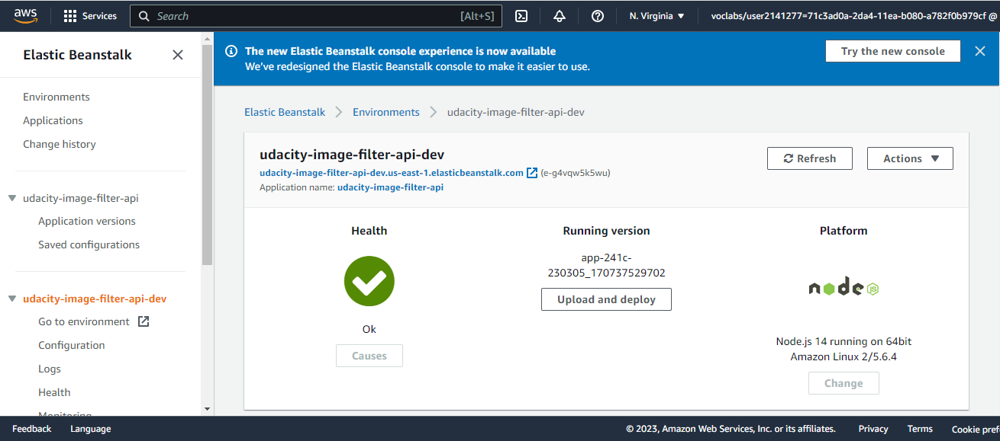

# Udagram Image Filtering Microservice

This application has been deployed to Elastic Beanstalk, URL : 
[Project URL](http://udacity-image-filter-api-dev.us-east-1.elasticbeanstalk.com/)


Sample Request:
[Sample Request](http://udacity-image-filter-api-dev.us-east-1.elasticbeanstalk.com/filteredimage?image_url=https://dev-to-uploads.s3.amazonaws.com/uploads/articles/fbsvcwqnj5mgkzuwy24r.png)


Udagram is a simple cloud application deployed on AWS Elastic Beanstalk. It allows users to register and log into a web client, post photos to the feed, and process photos using an image filtering microservice.

The project is split into three parts:
1. [The Simple Frontend](https://github.com/udacity/cloud-developer/tree/master/course-02/exercises/udacity-c2-frontend)
A basic Ionic client web application which consumes the RestAPI Backend. 
2. [The RestAPI Backend](https://github.com/udacity/cloud-developer/tree/master/course-02/exercises/udacity-c2-restapi), a Node-Express server which can be deployed to a cloud service. 
3. [The Image Filtering Microservice](https://github.com/udacity/cloud-developer/tree/master/course-02/project/image-filter-starter-code). It is a Node-Express application which runs a simple script to process images. 



## Tasks

### Setup Node Environment

You'll need to create a new node server. Open a new terminal within the project directory and run:

1. Initialize a new project: `npm i`
2. run the development server with `npm run dev`

### Create a new endpoint in the server.ts file

The code  in `./src/server.ts`  uses query parameter to download an image from a public URL, filter the image, and return the result.

Helper functions to handle some of these concepts and  import it at the top of the `./src/server.ts`  file.

```typescript
import {filterImageFromURL, deleteLocalFiles} from './util/util';
```

### Deploying your system

Commands:  `eb init` a new application and `eb create` a new environment to deploy your image-filter service! Don't forget you can use `eb deploy` to push changes.
